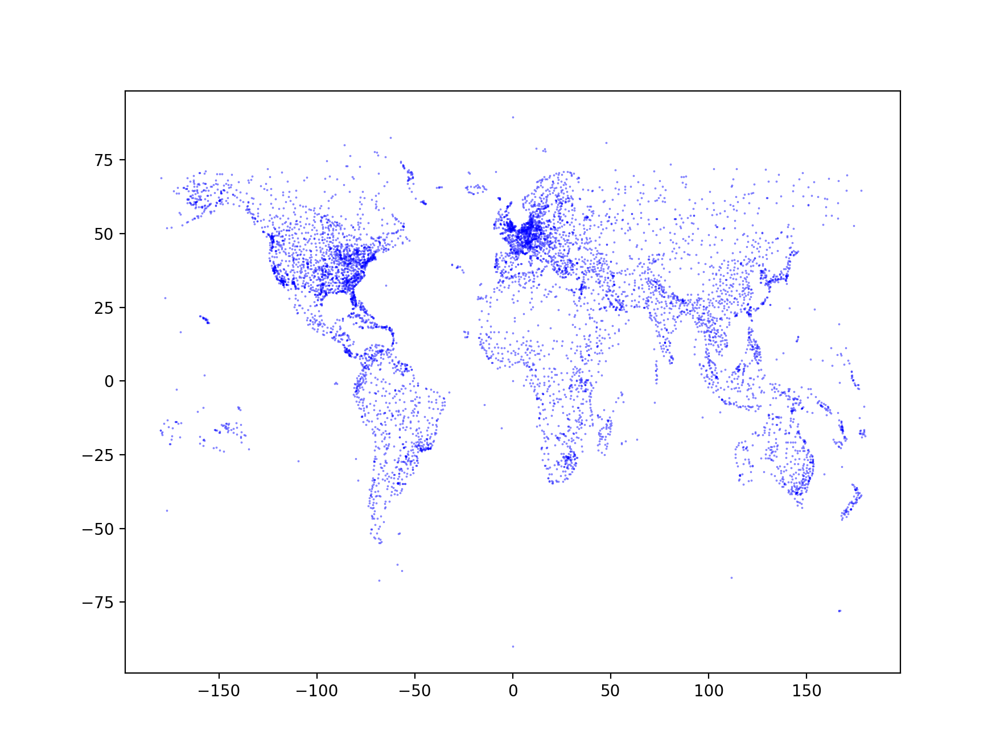
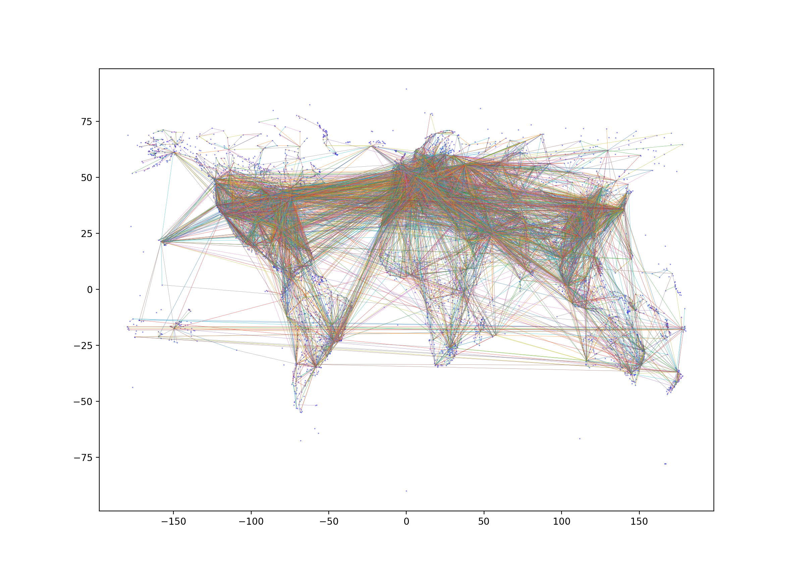
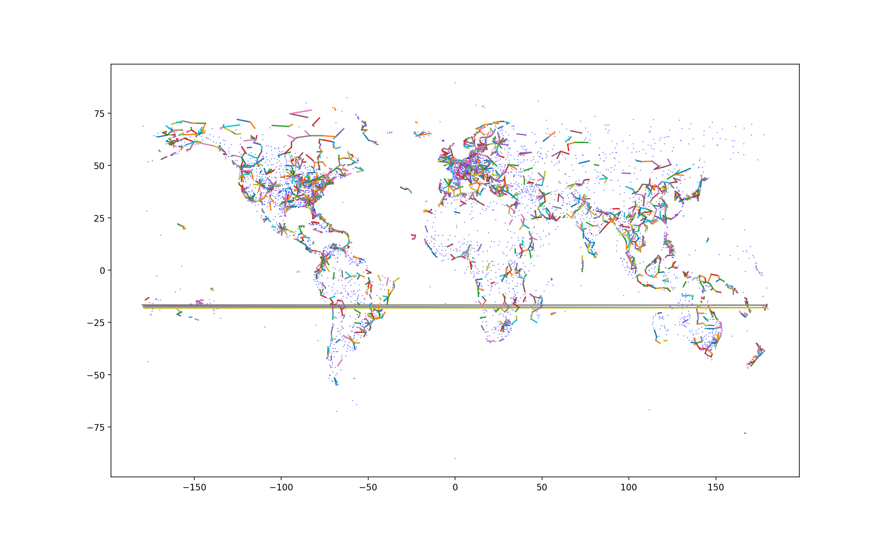
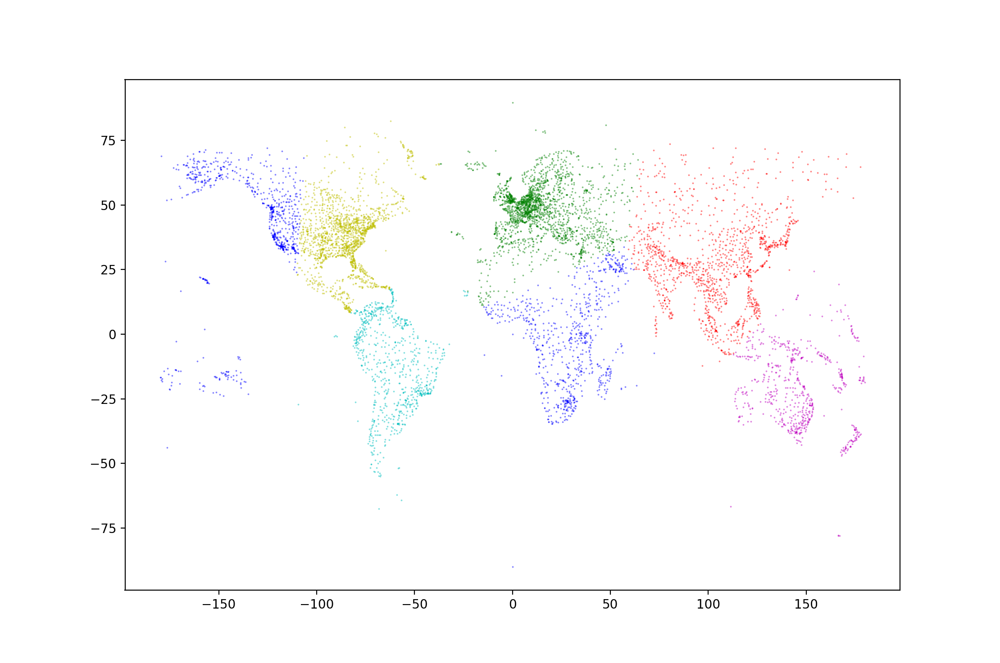

# Extra Lab: Clustering

Advanced Python Course, Chalmers DAT515, 2021

by Aarne Ranta

DRAFT, to be competed and finalized by 20 December

*This is an extra lab, thus not compulsory.*
*But it gives an opportunity to gain a higher grade.*
*It can give 6 bonus points.*
*The limit is 50 points in total for grade 5, 40 points for grade 4.* 
*Thus doing this lab is sufficient for grade 5, if you have done all bonus parts of the ordinary labs.*


## The problem

The problem of **clustering** is to divide a data set into parts that in some respects have similar properties internally.
For example, cities in densely populated areas can form a clusters that are separated by less populated areas.
Clustering algorithms are an example of **unsupervised machine learning**, where the algorithm identifies the clusters automatically, without anyone having to label the data
points.

In this lab, we will look at two clustering algorithms, both operating on a transport network graph.
In contrast to labs 1 to 3, we will now work with a much larger graph, consisting of *airports* as vertices and *direct flight connections* as edges.
Each airport has an associated *location* (latitude and longitude), from which the *distances* between airports can be computed as their geographical distance.

When plotting just the airports in a coordinate system (which is the first task you will do), we will see the following picture:



When plotting the flights as well, we will see something less clear:



As our first algorithm, we will cluster this graph using the **k-spanning tree** method and get something like 



with the value k=1000.
The method used is first to build a minimal spanning tree, then remove those 1000 edges that have the longes distance.

As the second algorithm, we perform clustering with the **k-means** method and obtain the picture



with k=7, where each of the seven clusters has its own colour.
The k-means algorithm, in briefly, identifies k data points as **centroids**.
All other points are clustered around the closest centroid.
The initial choice of centroids is random, but the algorithm performs an iteration that approximates the best set of centroids.
Notice that the way we have done it here only needs to look at the vertices of the graph, not the edges; the k-means algorithm is thus more generally applicable to all kind of data.


## The task

### Collecting the data

Your task is to write a Python file `cluster_network.py`, which first of all contains the following functions:

- `mk_airportdict(FILE)`, which reads airport data from `FILE` and constructs a dictionary where the location (and possible other information) about airports can be looked up. The keys of the dictionary are unique identifiers as specified below.

- `mk_routeset(FILE)` builds a set of routes that consist of pairs of keys to the airport dictionary.

- the constant `AIRPORTS_FILE`, which serves as argument to `mk_airportdict()`. You should download that file from the
[OpenFlights website](https://openflights.org/data.html), as the file
[airports.dat](https://raw.githubusercontent.com/jpatokal/openflights/master/data/airports.dat).

- the constant `ROUTES_FILE` used in `mk_routeset()`, downloaded as [routes.dat](https://raw.githubusercontent.com/jpatokal/openflights/master/data/routes.dat).

The `.dat` files are in the CSV format, which can be conveniently analysed with the standard `csv` library.
I have used the "Unique OpenFlights" identifiers as keys to airports.

Some of the data is not entirely well-formed, and you can just ignore it, by using a `try-except` block for each line you read.
There will be enough data anyway, with over 7,000 airports and over 60,000 routes.

For the sake of analysis, you should then build an undirected graph from the routes:

- `mk_routegraph(routeset)`

You can use the `networkx` graph class for this, to be sure that the algorithms to be imported from `networkx` work.
If you use your own implementation, then your `WeightedGraph` should store distances between connected vertices as weights.
In `networkx`, you store these weights directly in the edges.

To compute the geographical distance, you can use the `haversine` library, which was the baseline solution in Lab 1.
This is a better choice than the suggested bonus implementation in Lab 1, because the distances can be long.

### Visualization

Once you have built any of the data sets, it will be nice to see it visualized.
GraphViz will probably be too slow for this, but `matplotlib` works fine, and can also readily make use of the geographical locations as coordinates.
At this point, you should build two plots,

- one for just the airports, as scattered points;
- one for the routes, as lines connecting airports.

The first two of the pictures shown above give you an idea of how the pictures should look.
Build simple functions for these two tasks: they will be used as alternatives in a demo function.


### k-spanning tree

Write a function

- `k_spanning_tree(G, k = 1000)` returning a graph that consists of disconnected subtrees

following the algorithm that is explained, for instance, in these [slides](https://www.csc2.ncsu.edu/faculty/nfsamato/practical-graph-mining-with-R/slides/pdf/Graph_Cluster_Analysis.pdf) (the same as we watched at lecture 11), pages 13-15.

The function can use another function from `networkx`, namely
```
    algorithms.tree.mst.minimum_spanning_edges()
```
You function should return a new graph can be built from the *k* heaviest edges returned by this function.

The algorithm used by default to find the edges of the minimum spanning tree is *Kruskal's algorithm*.
You can read more about it in the [data structures course notes](https://chalmersgu-data-structure-courses.github.io/OpenDSA/Published/ChalmersGU-DSABook/html/Kruskal.html).
You could try and change it to *Prim's* algorithm, which is suggested in the slides mentioned above.
A summary of the differences can be found e.g. in [StackOverflow](https://stackoverflow.com/questions/1195872/when-should-i-use-kruskal-as-opposed-to-prim-and-vice-versa).

For demo and test purposes, also write a function that is able to visualize the retulting graph with `matplotlib`.


### k-means

Write a function

- `k_means(data, k=7)` returning a mapping from each point in the data to an integer in `range(k)`.

This function can use the `KMeans` class from the `sklearn.cluster` library.
How to use it is explained in [this Scikit Learn page](https://scikit-learn.org/stable/modules/generated/sklearn.cluster.KMeans.html).

Input data for `KMeans` can be sent through the `fit_predict()` method explained on the same web page.
It should be an "array-like sparse matrix", which can easily be built with the `array()` constructor of the `numpy` library, as shown in the Scikit examples.

It it interesting to experiment with different values of *k* and see how the world is divided into clusters.
You should, again, write a little demo function that combines all of the steps from reading data to showing it with `matplotlib`.
In this view, each of the clusters should use a different colour for the points in it.
(If you use *k* larger than 7, you may need to mark the differences in some other way, as the number of colours in `matplotlib` is limited.
But we do not require this in the lab.)


### The demo function

There should be a demo function that is run under the usual condition
```
    if __name__ == '__main__':
```
The function should read command-line arguments (from `sys.argv`) so that it shows `matplotlib` images in the following way, when your file is executed with
```
  $ python3 cluster_network.py <args>
```
with the date read from the defaule OpenFlights files:

- `airports`: show all airports as points,
- `routes`: show all routes as lines between airport points,
- `span <int>`: show the routes resulting from `k_spanning_tree(k=<init>)`,
- `means <int>`: show the coloured points resulting from `k_means(k=<init>)`,


