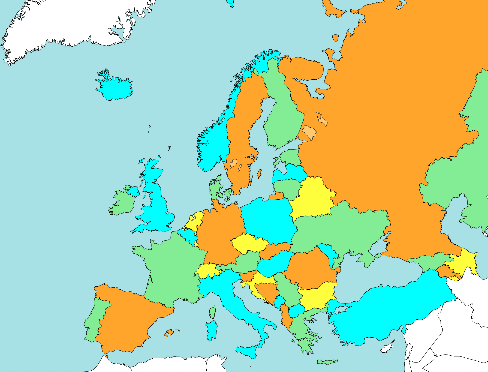

# Extra Lab 1: Graph Colouring

Advanced Python Course, Chalmers DAT515, 2021

by Aarne Ranta

DRAFT, to be competed and finalized by 20 December

*This is an extra lab, thus not compulsory.*
*But it gives an opportunity to gain a higher grade.*
*The limit of grade 5 is 50 points in total, of grade 4 it is 40 points.* 
*Thus, for instance, doing Part 1 of this lab is sufficient for grade 5, if you have done all bonus parts of the ordinary labs.*

## The problem

The problem of graph colouring is to assign colours to the vertices of a graph so that adjacent vertices always have different colours.
A famous mathematical result is the **Four-Colour Theorem**, stating that every planary graph (graph where no edges intersect) can be coloured with just four colours.

An application is colouring of geographical maps, so that neighbouring regions (such as countries) always have different colours.
By the Four-Colour Theorem, four different colours are possible for this.
As a demonstration of the current lab, we offer the map of Europe as an example of this.
Four instance, Germany has ten neighbours and one of them, France, has nine, but our algorithm will still be able to colour the map with four colours:

The underlying graph is more explicitly seen in this picture:

### For those interested (not covered in this lab)

Another application is **register allocation** in compilers.
The task there is to decide which variables are to be stored in the registers of the CPU, where they are much faster to manipulate than in the memory.
Since the number of registers is very limited, this becomes quickly an issue for programs that may need to store the values of hundreds or thousands of variables.
The graph representation of the problem creates vertices for each variable.
Edges are drawn between variables that are "live" at the same time, i.e. whose values can be needed at the same time.
This means that they cannot be stored in the same register.
Now, representing registers as colours reduces the register allocation problem to graph colouring.

The program analysis methods that are needed to encode the register allocation problem is beyond this course, so this application is not included in the lab.
But it is nice to know that the methods implemented here - like many other graph algorithms - can have widely different applications.

## The task, Part 1: the algorithm (6 points)

Graph colouring in general is an **NP-complete** problem, meaning that it is in a class of problems that can be unfeasible because of their complexity.
The method we are suggesting here is an approximative algorithm that runs in linear time and is the one commonly used for register allocation in compilers.
The description below comes from the book

Andrew Appel, *Modern Compiler Implementation in ML*, Cambridge University Press 1998.

Here is the book's description of the two steps of the algorithm, **simplify** and **select**:

As an example, let us go through the steps of achieving the colouring of the following graph with three colours:

## The task, Part 2: colouring an SVG map (4 points)

This part presupposes that you have done Part 1.
It applies the algorithm to maps given in the SVG format.
Thus the main part of the problem is to analyse and modify an SVG file so that its colours are changed in accordance with a colouring found by your algorithm.

