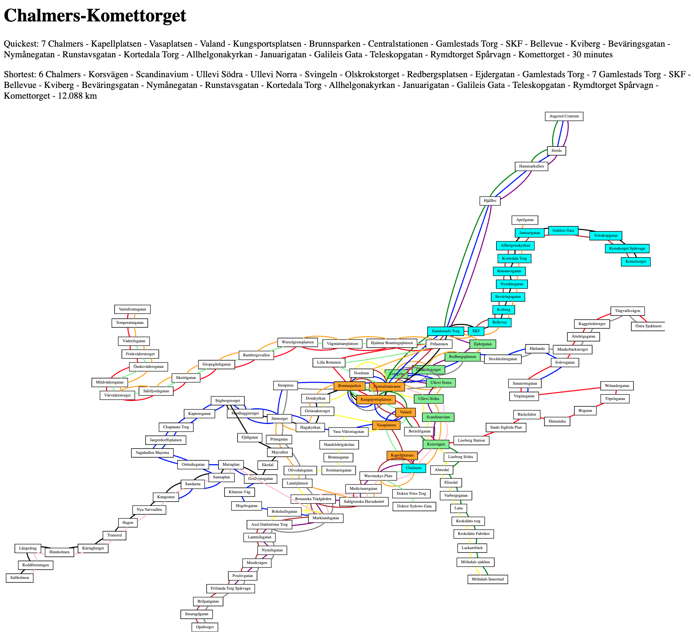

# Lab3: A web application for tram network

Advanced Python Course, Chalmers DAT515, 2021

by Aarne Ranta

## Purpose

The purpose is to build a web application replicating some functionalities of apps such as [Västtrafik](https://www.vasttrafik.se/reseplanering/reseplaneraren/).
Your application will

- display the complete map of tram lines
- highlight shortest paths in terms of time and geographical distance
- display a partial map with only a list of chosen lines

Here is an example screenshot:

Unlike the official app, ours will not have access to the actual timetables, but just to the distances and times as defined in Labs 1 and 2.
This is of course a severe simplification - but, on the other hand, our app will be usable for any transport system that can be represented by the class `TramNetwork`.

Another difference from the official app is that we only run ours in a safe `localhost` environment.
Thereby we do not have to cope with security issues, and it will also be much easier for all groups to finish the project.

The learning outcomes include:

- visualization with more details on positions and colours
- simple front-end construction with HTML, as well as external CSS and JavaScript
- putting everything together by using a webb application framework
- more details of `graphviz` library, various libraries belonging to the `flask` framework
- virtual environments (`venv`)

## The task

We will follow a standard line of work for the `flask` network.
There are several tutorials available, for instance, the one by [Miguel Grinberg](https://blog.miguelgrinberg.com/post/the-flask-mega-tutorial-part-i-hello-world), whose chapters 1 to 3 cover most of the things we need.

### The virtual environment

1. Create a `lab3` directory in your GitHub repository for the course.
2. Follow [the tutorial](https://blog.miguelgrinberg.com/post/the-flask-mega-tutorial-part-i-hello-world) to build a **virtual environment** (`venv`) for your application.
3. Activate the environment and install `flask` and other libraries that you need.

It is advisable to follow the tutorial, chapters 1 to 3, exactly before you start with your own project.
In this way, you can make sure that everything works as required.
But do not include this experiment in your course GitHub repository!

### Autocompletion

The route finding page helps users with autocompletion of tram stop names.
We provide ready-made Javascript and CSS files, given in the [static](./static) directory.
These files are copied and slightly modified from [W3Schools](https://www.w3schools.com/howto/howto_js_autocomplete.asp).
Since this kind of communication is not directly covered in Grinberg's tutorial, we also provide the HTML template file [route.html](./templates/route.html).

